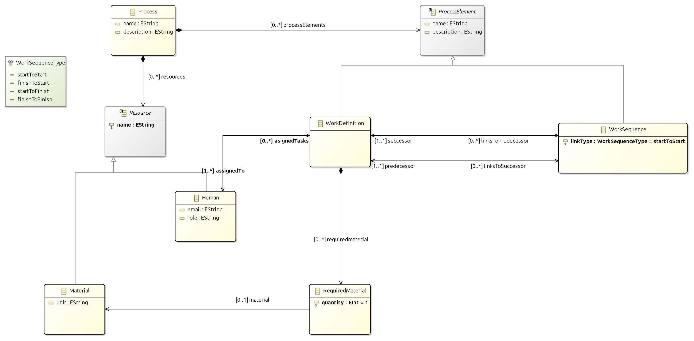
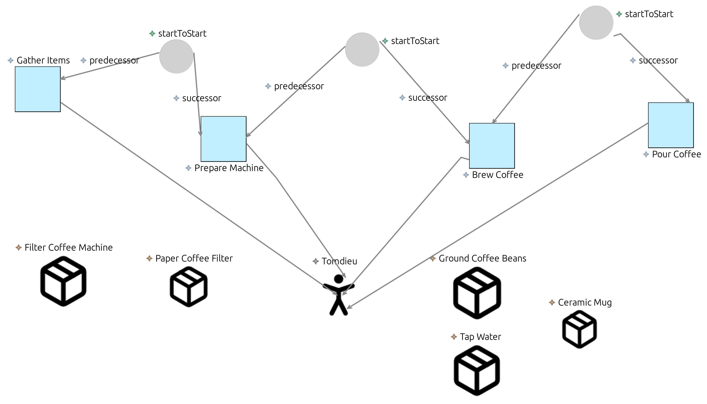
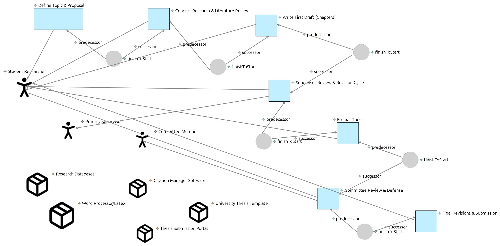

Voici la traduction du document Markdown en français :

# SimplePDL : Un Langage Simple de Définition de Processus

[](https://github.com/tomdieu/simplepdl-language)

```sh
git clone https://github.com/tomdieu/simplepdl-language
```

## Aperçu

SimplePDL (Process Description Language - Langage de Description de Processus) est un langage défini pour modéliser et représenter des processus métier ou techniques sous une forme structurée, facilement analysable et transformable. Il permet notamment de décrire les séquences d'activités au sein d'un processus.

Ce dépôt contient l'implémentation d'un SimplePDL étendu (v2), développé dans le cadre du Mini Projet d'Ingénierie Dirigée par les Modèles INF5039. Le langage et ses outils sont construits en utilisant :

1.  **Eclipse Modeling Framework (EMF) Ecore :** Pour définir la syntaxe abstraite (métamodèle), incluant des concepts comme `Process`, `WorkDefinition`, `WorkSequence`, `Resource` (Humaine/Matérielle), et des descriptions textuelles.
2.  **Object Constraint Language (OCL) :** Pour ajouter des règles de validation et des contraintes au métamodèle.
3.  **Xtext :** Pour fournir une syntaxe concrète textuelle permettant de définir des instances de processus.
4.  **Acceleo :** Pour les transformations modèle-vers-texte, générant une documentation HTML et des visualisations graphiques DOT à partir des instances de processus.
5.  **Sirius (Optionnel) :** Pour développer un éditeur de modélisation graphique (premières étapes explorées).

## Structure du Projet

L'espace de travail est organisé en plusieurs plugins Eclipse :

*   `simplepdl.metamodel` : Contient le modèle Ecore (`simplepdl.ecore`), le GenModel (`simplepdl.genmodel`), et les contraintes OCL (`simplepdl.ocl`). Ceci définit la "v2" de SimplePDL, intégrant des informations textuelles pour les éléments de processus et les définitions de ressources.
*   `simplepdl.metamodel.edit` : Plugin EMF Edit généré.
*   `simplepdl.metamodel.editor` : Plugin EMF Editor généré (basé sur un arbre).
*   `simplepdl.xtext` : Contient la grammaire Xtext (`SimplePDL.xtext`) et le workflow (`GenerateSimplePDL.mwe2`).
*   `simplepdl.xtext.ide` : Intégration IDE Xtext.
*   `simplepdl.xtext.ui` : Composants UI Xtext.
*   `simplepdl.xtext.tests` : Infrastructure de test Xtext.
*   `simplepdl.acceleo` : Contient les gabarits Acceleo (`.mtl`) pour la génération de code (HTML et DOT).
*   `simplepdl` : Un projet Java simple contenant des instances d'exemples (`.xmi`, `.simplepdl`).
*   `images` : Contient des captures d'écran et des diagrammes relatifs au projet.

## Pour commencer

### Prérequis

*   Eclipse Modeling Tools.
*   Installez Acceleo, Xtext et OCL depuis l'Eclipse Marketplace s'ils ne sont pas déjà inclus.
*   **Kit de Développement Java (JDK) :** La majorité des projets ont été développés et testés avec **JavaSE 17**.

### Clonage du Dépôt

Pour obtenir une copie locale du projet, clonez le dépôt en utilisant Git :

```bash
git clone https://github.com/tomdieu/simplepdl-language.git
cd simplepdl-language
```

Ensuite, importez les projets dans votre espace de travail Eclipse Modeling Tools.

## Détails d'Implémentation (II. Travail à faire)

Cette section suit la structure du "Travail à faire" décrite dans l'énoncé du projet.

### 1. Syntaxe Abstraite (Métamodèle - Ecore)

La structure centrale du langage SimplePDL v2 est définie dans `simplepdl.metamodel/model/simplepdl.ecore`. Cette version étend le SimplePDL de base pour inclure :
*   Des informations textuelles (ex : descriptions) pour les éléments de processus.
*   La définition des ressources (humaines et matérielles) nécessaires pour exécuter les tâches.

*   **Création du Projet :** Un projet de modélisation Ecore (`simplepdl.metamodel`) a été créé.
*   **Définition du Métamodèle :** Des concepts tels que `Process`, `WorkDefinition`, `WorkSequence`, `Resource`, `Human`, `Material`, `RequiredMaterial`, ainsi que leurs attributs (comme `description`, `email`, `role`, `unit`, `quantity`) et relations ont été définis.


*(Image : simplepdl.metamodel/simplepdl.jpg - Illustration du métamodèle étendu de SimplePDL)*

Après avoir défini le modèle `.ecore`, le `.genmodel` correspondant a été créé et utilisé pour générer le code du modèle EMF, de l'édition et de l'éditeur.

OK, je vais intégrer ces contraintes dans la section "2. Contraintes OCL" comme demandé, en utilisant "2.a" pour les descriptions et "2.b" pour le code OCL.

Voici la section mise à jour :

### 2. Contraintes OCL

L'Object Constraint Language (OCL) a été utilisé pour ajouter des règles de validation au métamodèle qui ne peuvent pas être exprimées par la structure Ecore seule. Ces contraintes assurent la correction sémantique et la cohérence des modèles SimplePDL.

*   **Création du Fichier OCL :**
    1.  Faites un clic droit sur le fichier `simplepdl.ecore` dans le projet `simplepdl.metamodel`.
    2.  Sélectionnez `Nouveau` > `Autre...`.
    3.  Choisissez `OCL` > `Fichier OCL (Document OCL Complet)`.
    4.  Nommez le fichier `simplepdl.ocl`.
*   **Écriture des Contraintes :** Les invariants suivants ont été définis dans le fichier `simplepdl.ocl`, en référençant les éléments Ecore :

#### 2.a. Contraintes Définies

1.  **Le nom du Processus ne doit pas être vide :** Chaque `Process` doit avoir un nom non vide.
2.  **Le nom de la Ressource ne doit pas être vide :** Chaque `Resource` (Humaine ou Matérielle) doit avoir un nom non vide.
3.  **Une Ressource Humaine doit avoir au moins une tâche assignée :** Chaque ressource `Human` doit être assignée à au moins une `WorkDefinition`.
4.  **Une WorkDefinition doit être assignée à au moins une Ressource Humaine :** Chaque `WorkDefinition` (tâche) doit avoir au moins une ressource `Human` qui lui est assignée.
5.  **Une WorkSequence doit avoir un prédécesseur et un successeur :** Chaque `WorkSequence` doit définir à la fois une `WorkDefinition` prédécesseur et une `WorkDefinition` successeur.
6.  **Une WorkSequence doit avoir un type de lien :** Chaque `WorkSequence` doit avoir un `WorkSequenceType` (ex : finVersDebut) défini.
7.  **La quantité de RequiredMaterial doit être positive :** La `quantity` d'un `RequiredMaterial` pour une `WorkDefinition` doit être supérieure à zéro.
8.  **RequiredMaterial doit référencer une Ressource Matérielle :** Chaque entrée `RequiredMaterial` doit référencer une ressource `Material` existante.
9.  **Pas de noms de Ressources en double dans un Processus :** Au sein d'un même `Process`, tous les noms de `Resource` (Humaines et Matérielles) doivent être uniques.
10. **Pas de noms de WorkDefinition en double dans un Processus :** Au sein d'un même `Process`, tous les noms de `WorkDefinition` doivent être uniques.
11. **Pas de WorkSequence auto-référencée :** Une `WorkSequence` ne peut pas avoir la même `WorkDefinition` comme prédécesseur et successeur (c.-à-d. qu'une tâche ne peut pas dépendre directement d'elle-même).
12. **Les tâches assignées à chaque Ressource Humaine doivent uniquement inclure des WorkDefinitions du même Processus :** Pour toute ressource `Human`, toutes les `WorkDefinition`s qui lui sont assignées doivent appartenir au même `Process` qui contient la ressource `Human`.

#### 2.b. Implémentation OCL

Le code OCL ci-dessous implémente les contraintes définies ci-dessus. Ce code est placé dans le fichier `simplepdl.metamodel/simplepdl.ocl` et intégré avec le métamodèle Ecore pour la validation.

<details>
<summary><b>Code OCL (`simplepdl.ocl`)</b></summary>

```ocl
import 'simplepdl.ecore'

package simplepdl

-- 1. Process Name Must Not Be Empty
context Process
inv NameNotEmpty: not self.name.oclIsUndefined() and self.name <> ''

-- 2. Resource Name Must Not Be Empty
context Resource
inv NameNotEmpty: not self.name.oclIsUndefined() and self.name <> ''

-- 3. Human Must Have At Least One Assigned Task
-- Note: The metamodel shows 'asignedTasks' (with one 's') as a derived, read-only opposite of WorkDefinition.assignedTo.
-- If this constraint is to be actively enforced on model creation/modification,
-- it implies that a Human cannot exist without being immediately assigned to a task,
-- or that assignedTo on WorkDefinition is mandatory and a Human is created alongside.
-- Let's assume 'asignedTasks' is correctly populated by EMF from 'assignedTo'.
context Human
inv AtLeastOneAssignedTask: not self.asignedTasks->isEmpty()

-- 4. WorkDefinition Must Be Assigned to At Least One Human
context WorkDefinition
inv AtLeastOneHuman: not self.assignedTo->isEmpty()

-- 5. WorkSequence Must Have Predecessor and Successor
context WorkSequence
inv PredecessorAndSuccessor:
    not self.predecessor.oclIsUndefined() and
    not self.successor.oclIsUndefined()

-- 6. WorkSequence Must Have a Link Type
context WorkSequence
inv LinkTypeDefined: not self.linkType.oclIsUndefined()

-- 7. RequiredMaterial Quantity Must Be Positive
context RequiredMaterial
inv PositiveQuantity: not self.quantity.oclIsUndefined() and self.quantity > 0

-- 8. RequiredMaterial Must Reference a Material
context RequiredMaterial
inv MaterialDefined: not self.material.oclIsUndefined()

-- 9. No Duplicate Resource Names in a Process
context Process
inv UniqueResourceNames:
    self.resources->isUnique(r | r.name)

-- 10. No Duplicate WorkDefinition Names in a Process
context Process
inv UniqueWorkDefinitionNames:
    self.processElements->select(oclIsTypeOf(WorkDefinition))
                           ->collect(oclAsType(WorkDefinition))
                           ->isUnique(wd | wd.name)

-- 11. No Self-Referencing WorkSequence
context WorkSequence
inv NotSelfReferencing: self.predecessor <> self.successor

-- 12. Each Human's AssignedTasks Must Include Only WorkDefinitions in the Same Process
-- This constraint ensures that a Human resource listed in a Process is only assigned
-- to WorkDefinitions also listed as processElements within that *same* Process.
context Process
inv AssignedTasksInSameProcessForHumans:
    self.resources->select(oclIsTypeOf(Human))
                   ->collect(oclAsType(Human))
                   ->forAll(h |
                       h.asignedTasks->forAll(wd |
                           self.processElements->includes(wd)
                       )
                   )
-- An alternative or complementary way to phrase constraint 12 from the Human's perspective,
-- although the Process context is generally better for global consistency.
-- context Human
-- inv AssignedTasksInSameProcess:
--    Process.allInstances()->exists(p |
--        p.resources->includes(self) and
--        self.asignedTasks->forAll(wd | p.processElements->includes(wd))
--    )

endpackage
```
*(Note : Des ajustements mineurs ont été apportés à la contrainte 10 pour plus de clarté avec les opérations de collection OCL et à la contrainte 12 pour être plus directement vérifiable depuis le contexte `Process`, ce qui est généralement plus efficace pour de telles vérifications. La contrainte 12 originale du contexte `Human` pourrait être moins performante car elle itère sur `allInstances()`.)*
</details>

Cette section mise à jour est maintenant intégrée dans la structure README que vous avez fournie. Le reste du README demeure tel que généré précédemment.

### 3. Test du Langage

#### 3.a. Exemples de Processus (Descriptions de Niveau M0)

Deux exemples de processus ont été choisis et décrits :

<details>
<summary><b>Exemple 1 : Processus "Make Coffee Process" (Niveau M0)</b></summary>

```
Le processus Make Coffee Process comprend :

    Quatre tâches (WorkDefinition) : Gather Items, Prepare Machine, Brew Coffee, Pour Coffee.

    Trois séquences (WorkSequence) : Seq Gather to Prepare, Seq Prepare to Brew, Seq Brew to Pour.

    Une ressource humaine (Human) : Barista (rôle : 'Coffee Maker').

    Cinq ressources matérielles (Material) : Filter Coffee Machine (unité : 'device'), Paper Coffee Filter (unité : 'piece'), Ground Coffee Beans (unité : 'gram'), Tap Water (unité : 'ml'), Ceramic Mug (unité : 'item').

Chaque tâche (Gather Items, Prepare Machine, Brew Coffee, Pour Coffee) est assignée à la ressource humaine Barista.

La tâche Prepare Machine nécessite :

    1 Paper Coffee Filter.

    15 Ground Coffee Beans.

    300 Tap Water.

La tâche Brew Coffee nécessite 1 Filter Coffee Machine.

La tâche Pour Coffee nécessite 1 Ceramic Mug.

Les séquences définissent des contraintes d'ordre :

    Prepare Machine ne peut commencer qu'après la fin de Gather Items (via Seq Gather to Prepare, type : finishToStart).

    Brew Coffee ne peut commencer qu'après la fin de Prepare Machine (via Seq Prepare to Brew, type : finishToStart).

    Pour Coffee ne peut commencer qu'après la fin de Brew Coffee (via Seq Brew to Pour, type : finishToStart).
```
</details>

<details>
<summary><b>Exemple 2 : Processus "Write Master Thesis" (Niveau M0)</b></summary>

```
Le processus Write Master Thesis comprend :

    Sept tâches (WorkDefinition) : Define Topic & Proposal, Conduct Research & Literature Review, Write First Draft (Chapters), Supervisor Review & Revision Cycle, Format Thesis, Committee Review & Defense, Final Revisions & Submission.

    Six séquences (WorkSequence) : Seq_Proposal_Research, Seq_Research_Draft, Seq_Draft_Review, Seq_Review_Format, Seq_Format_Defense, Seq_Defense_Submit.

    Trois ressources humaines principales (Human) : Student Researcher (rôle : 'Author'), Primary Supervisor (rôle : 'Advisor'), Committee Member (rôle : 'Examiner'). (Note : Plus de membres de comité pourraient être ajoutés).

    Cinq ressources matérielles clés (Material) : Research Databases (unité : 'subscription access'), Citation Manager Software (unité : 'license'), Word Processor/LaTeX (unité : 'license'), University Thesis Template (unité : 'document'), Thesis Submission Portal (unité : 'web service access'). (Note : Des bases de données, logiciels ou équipements de laboratoire plus spécifiques pourraient être ajoutés).

Chaque tâche est principalement assignée à une ressource humaine (bien que d'autres puissent contribuer) :

    Define Topic & Proposal est assignée à Student Researcher (avec l'avis du superviseur).

    Conduct Research & Literature Review est assignée à Student Researcher.

    Write First Draft (Chapters) est assignée à Student Researcher.

    Supervisor Review & Revision Cycle est assignée à Primary Supervisor (partie relecture) et Student Researcher (partie révision). (Note sur le métamodèle : Votre métamodèle actuel assigne une tâche à une seule personne (borne inférieure de assignedTo=1). Pour les cycles de relecture, vous pourriez modéliser cela comme des tâches "Relecture" et "Révision" séparées ou reconnaître cette limitation dans la description M0). Assignons la responsabilité principale du cycle à Primary Supervisor pour l'initiation de la relecture.

    Format Thesis est assignée à Student Researcher.

    Committee Review & Defense est assignée à Committee Member (relecture/examen) et Student Researcher (soutenance). Assignation de la responsabilité principale à Committee Member.

    Final Revisions & Submission est assignée à Student Researcher.

Certaines tâches nécessitent des ressources matérielles :

    Conduct Research & Literature Review nécessite Research Databases et Citation Manager Software.

    Write First Draft (Chapters) nécessite Word Processor/LaTeX et Citation Manager Software.

    Supervisor Review & Revision Cycle nécessite Word Processor/LaTeX (pour les révisions).

    Format Thesis nécessite Word Processor/LaTeX et University Thesis Template.

    Final Revisions & Submission nécessite Word Processor/LaTeX et Thesis Submission Portal.

Les séquences définissent les principales contraintes d'ordre (toutes supposées de type : finishToStart) :

    Conduct Research & Literature Review ne peut commencer qu'après la fin de Define Topic & Proposal.

    Write First Draft (Chapters) ne peut commencer qu'après la fin de Conduct Research & Literature Review.

    Supervisor Review & Revision Cycle ne peut commencer qu'après la fin de Write First Draft (Chapters). (Ceci représente le premier cycle majeur de relecture).

    Format Thesis ne peut commencer qu'après la fin de Supervisor Review & Revision Cycle (impliquant l'approbation du brouillon par le superviseur).

    Committee Review & Defense ne peut commencer qu'après la fin de Format Thesis (thèse soumise au comité).

    Final Revisions & Submission ne peut commencer qu'après la fin de Committee Review & Defense (et en supposant une soutenance réussie avec révisions).
```
</details>

#### 3.b. Modélisation avec l'Éditeur Arborescent EMF

Ces processus ont ensuite été modélisés comme des instances du métamodèle SimplePDL v2 en utilisant l'éditeur arborescent EMF généré. Les fichiers `.xmi` résultants se trouvent dans `simplepdl/instances/`.

*   **Vue arborescente pour le processus Make Coffee :**
    
    *(Note : Le titre de l'image indique "prepare breakfast" mais montre probablement "MakeCoffee" ou une structure similaire basée sur le contexte)*

*   **Vue arborescente pour le processus Write Master Thesis :**
    

### 4. Transformation Modèle-vers-Texte (Acceleo)

Acceleo a été utilisé pour les transformations Modèle-vers-Texte (M2T) afin de générer :
*   **4.a. Une documentation HTML** pour les modèles de processus.
*   **4.b. Des descriptions en langage DOT** pour la visualisation graphique des modèles de processus.

*   **Création du Projet Acceleo :**
    1.  Un nouveau projet Acceleo (`simplepdl.acceleo`) a été créé.
        
    2.  L'URI du métamodèle `http://www.example.org/simplepdl` (tel que défini dans les fichiers `.ecore` et `.genmodel`) a été ajoutée.
        
    3.  Les options pour générer un fichier et un gabarit principal ont été cochées, créant un fichier `.mtl`.

*   **Écriture des Transformations Acceleo :**
    Les gabarits ont été définis dans `simplepdl.acceleo/src/simplepdl/acceleo/generate.mtl` pour interroger les modèles SimplePDL et générer les sorties HTML et DOT.

    <details>
    <summary><b>Code de Transformation Acceleo (`generate.mtl`)</b></summary>

    ```mtl
    [comment encoding = UTF-8 /]
    [module generate('http://www.example.org/simplepdl')]

    [template public generateElement(aProcess : Process)]
    [comment @main/]
    [file (aProcess.name + '.html', false, 'UTF-8')]
    <!DOCTYPE html>
    <html>
    <head>
        <meta charset="UTF-8">
        <title>[aProcess.name/] Process Details</title>
        <style>
            body { font-family: Arial, sans-serif; margin: 20px; }
            h1, h2, h3 { color: #333366; }
            .process { border: 1px solid #ddd; padding: 15px; margin-bottom: 20px; }
            .work-definition { background-color: #f9f9f9; padding: 10px; margin: 10px 0; border-left: 5px solid #4CAF50; }
            .work-sequence { background-color: #f5f5f5; padding: 5px; margin: 5px 0; border-left: 5px solid #2196F3; }
            .resource { background-color: #fff8e1; padding: 8px; margin: 8px 0; border-left: 5px solid #FF9800; }
            .material { background-color: #e8f5e9; padding: 8px; margin: 8px 0; border-left: 5px solid #8BC34A; }
            table { border-collapse: collapse; width: 100%; margin: 10px 0; }
            th, td { border: 1px solid #ddd; padding: 8px; text-align: left; }
            th { background-color: #f2f2f2; }
        </style>
    </head>
    <body>
        <h1>[aProcess.name/] Process</h1>
        [if (aProcess.description <> null)]
        <p><strong>Description:</strong> [aProcess.description/]</p>
        [/if]

        <div class="process">
            <h2>Work Definitions</h2>
            <table>
        <tr>
            <th>Name</th>
            <th>Description</th>
            <th>Assigned To</th>
            <th>Required Materials</th>
            <th>Dependencies</th>
        </tr>
        [for (element : ProcessElement | aProcess.processElements)]
            [if (element.oclIsTypeOf(WorkDefinition))]
                [let wd : WorkDefinition = element.oclAsType(WorkDefinition)]
                <tr>
                    <td>[wd.name/]</td>
                    <td>
                        [if (wd.description <> null)]
                            [wd.description/]
                        [/if]
                    </td>
                    <td>
                        [if (not wd.assignedTo->isEmpty())]
                            [for (human : Human | wd.assignedTo) separator(', ')]
                                [human.name/] ([human.role/])
                            [/for]
                        [/if]
                    </td>
                    <td>
                        [if (not wd.requiredmaterial->isEmpty())]
                            <ul>
                            [for (req : RequiredMaterial | wd.requiredmaterial)]
                                <li>[req.quantity/] [req.material.unit/] of [req.material.name/]</li>
                            [/for]
                            </ul>
                        [/if]
                    </td>
                    <td>
                        [if (not wd.linksToSuccessor->isEmpty())]
                            <ul>
                            [for (seq : WorkSequence | wd.linksToSuccessor)]
                                <li>When this task
                                    [if (seq.linkType = WorkSequenceType::finishToStart or seq.linkType = WorkSequenceType::finishToFInish)]finishes[else]starts[/if],
                                    task "[seq.successor.name/]" can
                                    [if (seq.linkType = WorkSequenceType::finishToStart or seq.linkType = WorkSequenceType::startToStart)]start[else]finish[/if]
                                </li>
                            [/for]
                            </ul>
                        [/if]
                    </td>
                </tr>
                [/let]
            [/if]
        [/for]
    </table>

            <h2>Work Sequences</h2>
            <table>
        <tr>
            <th>Name</th>
            <th>Predecessor</th>
            <th>Successor</th>
            <th>Condition</th>
        </tr>
        [for (element : ProcessElement | aProcess.processElements)]
            [if (element.oclIsTypeOf(WorkSequence))]
                [let ws : WorkSequence = element.oclAsType(WorkSequence)]
                <tr>
                    <td>[ws.name/]</td>
                    <td>[ws.predecessor.name/]</td>
                    <td>[ws.successor.name/]</td>
                    <td>
                        [if (ws.linkType = WorkSequenceType::finishToStart)]
                            Finish to Start
                        [elseif (ws.linkType = WorkSequenceType::startToStart)]
                            Start to Start
                        [elseif (ws.linkType = WorkSequenceType::startToFinish)]
                            Start to Finish
                        [elseif (ws.linkType = WorkSequenceType::finishToFInish)]
                            Finish to Finish
                        [/if]
                    </td>
                </tr>
                [/let]
            [/if]
        [/for]
    </table>

            <h2>Resources</h2>
            <h3>Human Resources</h3>
            <table>
                <tr>
                    <th>Name</th>
                    <th>Role</th>
                    <th>Email</th>
                    <th>Assigned Tasks</th>
                </tr>
                [for (resource : Resource | aProcess.resources)]
                    [if (resource.oclIsTypeOf(Human))]
                        [let human : Human = resource.oclAsType(Human)]
                        <tr>
                            <td>[human.name/]</td>
                            <td>[human.role/]</td>
                            <td>[human.email/]</td>
                            <td>
                                [for (task : WorkDefinition | human.asignedTasks) separator(', ')]
                                    [task.name/]
                                [/for]
                            </td>
                        </tr>
                        [/let]
                    [/if]
                [/for]
            </table>

            <h3>Material Resources</h3>
            <table>
                <tr>
                    <th>Name</th>
                    <th>Unit</th>
                    <th>Used In</th>
                </tr>
                [for (resource : Resource | aProcess.resources)]
                    [if (resource.oclIsTypeOf(Material))]
                        [let material : Material = resource.oclAsType(Material)]
                        <tr>
                            <td>[material.name/]</td>
                            <td>[material.unit/]</td>
                            <td>
                                [for (wd : WorkDefinition | aProcess.processElements->select(e | e.oclIsTypeOf(WorkDefinition)))]
                                    [for (req : RequiredMaterial | wd.oclAsType(WorkDefinition).requiredmaterial)]
                                        [if (req.material = material)]
                                            [wd.name/] ([req.quantity/]),
                                        [/if]
                                    [/for]
                                [/for]
                            </td>
                        </tr>
                        [/let]
                    [/if]
                [/for]
            </table>
        </div>


    </body>
    </html>
    [/file]

    [file (aProcess.name.concat('.dot'), false, 'UTF-8')]
    digraph "[aProcess.name.replaceAll(' ', '_')/]" {
        [for (element : ProcessElement | aProcess.processElements)]
            [if (element.oclIsTypeOf(WorkDefinition))]
                "[element.name.replaceAll(' ', '_')/]";
            [/if]
        [/for]

        [for (element : ProcessElement | aProcess.processElements)]
            [if (element.oclIsTypeOf(WorkSequence))]
                "[element.oclAsType(WorkSequence).predecessor.name.replaceAll(' ', '_')/]" -> "[element.oclAsType(WorkSequence).successor.name.replaceAll(' ', '_')/]";
            [/if]
        [/for]
    }
    [/file]
    [/template]
    ```
    </details>

*   **Exécution des Transformations :**
    1.  Faites un clic droit sur le fichier `.mtl` principal (`generate.mtl`).
    2.  Sélectionnez `Exécuter en tant que` > `Configurations d'exécution...`.
    3.  Créez une nouvelle configuration sous `Application Acceleo`.
        
    4.  **Modèle :** Sélectionnez un fichier d'instance de modèle d'entrée (ex : `simplepdl/instances/MakeCoffee.xmi`).
    5.  **Cible :** Sélectionnez le dossier de sortie (ex : `simplepdl.acceleo/output`).
    6.  Cliquez sur `Exécuter`.

*   **Exemples de Sorties Générées :**
    *   **Fichiers DOT :** Représentation textuelle de graphes (peut être visualisée avec Graphviz).
        *   Sortie DOT de Make Coffee :
            
        *   Sortie DOT de Write Master Thesis :
            
    *   **Fichiers HTML :** Documentation générée à partir des modèles de processus.
        *   Sortie HTML de Make Coffee :
            
        *   Sortie HTML de Write Master Thesis :
            

### 5. Syntaxe Concrète

OK, j'ai mis à jour la section `5.a. Syntaxe Graphique (Sirius)` pour améliorer son professionnalisme et sa clarté, en incorporant les étapes et les exemples que vous avez fournis.

Voici la section révisée :

---

#### 5.a. Syntaxe Graphique (Sirius)

Sirius est un puissant framework Eclipse qui facilite la création d'ateliers de modélisation graphique personnalisés, permettant des représentations visuelles et des interactions spécifiques au domaine. Pour le projet SimplePDL, le développement d'un éditeur graphique basé sur Sirius a été exploré. Bien que non entièrement implémenté dans la configuration finale en raison de complexités rencontrées ou de contraintes de temps, l'approche envisagée et les résultats illustratifs sont décrits ci-dessous.

*   **Prérequis : Génération du Code de Support EMF**
    Avant de définir un éditeur Sirius, les plugins fondamentaux du modèle, de l'édition et de l'éditeur EMF doivent être générés. Ceci est réalisé en :
    1.  Ouvrant le fichier `simplepdl.genmodel`.
    2.  Faisant un clic droit sur l'élément racine.
    3.  Sélectionnant séquentiellement `Générer le code du modèle`, `Générer le code d'édition`, et `Générer le code de l'éditeur`. Cela peuple les plugins `simplepdl.metamodel.edit` et `simplepdl.metamodel.editor`, fournissant l'éditeur arborescent de base et l'accès programmatique requis par Sirius.

*   **Définition de l'Éditeur Graphique (Spécification de Point de Vue Sirius)**
    Le cœur d'un éditeur Sirius réside dans son Modèle de Spécification de Point de Vue (fichier `.odesign`), qui définit comment les concepts du métamodèle sont graphiquement représentés et manipulés.
    1.  **Créer un Projet de Spécification de Point de Vue :** Un projet Eclipse dédié (ex : `simplepdl.sirius.design`) est créé pour héberger la spécification Sirius.
    2.  **Concevoir les Points de Vue et les Représentations :** Dans le fichier `.odesign`, les points de vue, les représentations de diagrammes (ex : pour les Processus, WorkDefinitions, WorkSequences), et les outils associés (pour créer et lier des éléments) sont définis. Cela implique :
        *   Mapper les éléments Ecore de `simplepdl.ecore` (ex : `Process`, `WorkDefinition`, `Resource`) à des nœuds et des arêtes graphiques.
        *   Configurer leur apparence (formes, couleurs, icônes, étiquettes).
        *   Définir des outils de navigation et d'édition (ex : palettes pour créer de nouvelles tâches, outils pour dessiner des liens de séquence).

*   **Processus Illustratif pour Visualiser les Modèles avec Sirius**
    Une fois qu'un point de vue Sirius est défini et activé dans une instance Eclipse d'exécution, les utilisateurs peuvent créer et interagir avec des représentations graphiques de leurs modèles SimplePDL. Le flux de travail typique serait :
    1.  **Activer le Point de Vue SimplePDL :** Dans la perspective de modélisation Eclipse, assurez-vous que le point de vue SimplePDL personnalisé (défini dans le fichier `.odesign`) est activé.
    2.  **Créer un Projet de Modélisation :** Établissez un nouveau projet (ex : via `Fichier > Nouveau > Projet... > Général > Projet`) pour servir de conteneur aux instances de modèle SimplePDL et à leurs représentations graphiques Sirius correspondantes.
    3.  **Créer ou Importer une Instance de Modèle :**
        *   Une instance de modèle SimplePDL est requise. Elle peut être créée, par exemple, en utilisant l'assistant généré par EMF : `Nouveau > Autre... > Assistants de création de modèles EMF exemples > Modèle Simplepdl`.
        *   Sélectionnez `Process` comme objet modèle racine et sauvegardez l'instance (typiquement sous forme de fichier `.xmi`, ex : `MakeCoffee.xmi`). Alternativement, un fichier `.simplepdl` existant créé via Xtext pourrait servir de modèle sémantique si le VSM Sirius est configuré pour le supporter.
    4.  **Initialiser une Représentation Graphique Sirius :**
        *   Dans le Projet de Modélisation, faites un clic droit et sélectionnez `Nouveau > Modèle de points de vue` (ou `Nouveau > Autre... > Sirius > Fichier de représentations`) pour créer un fichier de représentation Sirius (ex : `MakeCoffee_diagrams.aird`).
        *   Ouvrez le fichier `.aird`. Faites un clic droit sur l'instance de modèle sémantique (ex : `MakeCoffee.xmi` ou l'élément racine `Process` à l'intérieur) dans l'Explorateur de Modèles, ou directement dans l'éditeur `.aird`, et sélectionnez le type de diagramme désiré (ex : "Diagramme de Processus SimplePDL") qui a été défini dans la spécification `.odesign`. Cela initialise un nouveau diagramme visualisant le modèle sélectionné.

*   **Exemples de Représentations Sirius (Conceptuelles)**
    Les images suivantes illustrent les représentations graphiques anticipées pour les processus exemples en utilisant un éditeur basé sur Sirius.

    *   **Processus Make Coffee - Représentation Sirius :**
        
        *(Légende : Diagramme Sirius conceptuel visualisant le processus "Make Coffee", montrant les tâches et leurs dépendances.)*

    *   **Processus Write Master Thesis - Représentation Sirius :**
        
        *(Légende : Diagramme Sirius conceptuel pour le processus "Write Master Thesis", illustrant ses définitions de travail et séquences constitutives.)*

---

#### 5.b. Syntaxe Textuelle (Xtext)

Xtext a été utilisé pour définir un Langage Spécifique au Domaine (DSL) pour créer textuellement des instances de processus SimplePDL, en utilisant l'extension de fichier `.simplepdl`.

*   **Création du Projet Xtext :**
    1.  Un nouveau projet Xtext `simplepdl.xtext` a été créé.
        
        *   Nom du projet : `simplepdl.xtext`
        *   Nom du langage : `simplepdl.xtext.SimplePDL`
        *   Extension du langage : `simplepdl`

*   **Définition de la Grammaire Xtext :**
    La grammaire a été définie dans `simplepdl.xtext/src/simplepdl/xtext/SimplePDL.xtext`, mappant les mots-clés et la structure aux éléments du métamodèle Ecore.

    <details>
    <summary><b>Grammaire Xtext (`SimplePDL.xtext`)</b></summary>

    ```xtext
    grammar simplepdl.xtext.SimplePDL with org.eclipse.xtext.common.Terminals

    generate simplePDL "http://www.example.org/simplepdl" // Ensure this URI matches your Ecore's nsURI

    Model:
        processes+=Process*;

    Process:
        'process' name=ID '{'
            ('description' description=STRING)?
            ( (processElements+=WorkDefinition | processElements+=WorkSequence) | resources+=Resource )* // Allow mixed order
        '}'
    ;

    WorkDefinition returns ProcessElement: // Specify return type if it's a subtype
        'workdefinition' name=ID '{'
            ('description' description=STRING)?
            ('assignedTo' assignedTo+=[Human|ID] (',' assignedTo+=[Human|ID])*)?
            ('requiredMaterial' requiredmaterial+=RequiredMaterial (',' requiredmaterial+=RequiredMaterial)* )* // Corrected 'requiredMaterials' to 'requiredmaterial' as per common metamodel naming. Adjust if your ecore uses 'requiredMaterials'.
        // Links to predecessor/successor via WorkSequence elements, not directly in WorkDefinition as per base metamodel.
        // If you intend direct links in WD, the metamodel and grammar need to reflect that.
        // For now, assuming WorkSequences are separate as per the original SimplePDL metamodel.
        '}'
    ;

    WorkSequence returns ProcessElement: // Specify return type
        'worksequence' name=ID '{'
            'predecessor' predecessor=[WorkDefinition|ID]
            'successor' successor=[WorkDefinition|ID]
            'type' type=WorkSequenceType
        '}'
    ;

    RequiredMaterial:
        '[' 'material' material=[Material|ID]
            ('quantity' '=' quantity=INT)?
        ']'
    ;

    Resource: // This will be an abstract rule if Human and Material are EClasses
        Human | Material
    ;

    Human:
        'human' name=ID '{'
            ('email' email=STRING)? // Made optional
            ('role' role=STRING)?   // Made optional
        '}'
    ;

    Material:
        'material' name=ID '{'
            ('unit' unit=STRING)?   // Made optional
        '}'
    ;

    enum WorkSequenceType:
        startToStart   = 'startToStart' |
        finishToStart  = 'finishToStart' |
        startToFinish  = 'startToFinish' |
        finishToFinish = 'finishToFinish' // Corrected 'finishToFInish' from Acceleo template if it was a typo
    ;
    ```
    *(Note : La grammaire Xtext a été légèrement ajustée pour la cohérence avec les structures Ecore typiques et pour corriger les décalages potentiels observés dans les données d'image originales, par exemple en rendant les attributs Humain/Matériel optionnels, la gestion de ProcessElement. L'URI dans `generate simplePDL` doit correspondre au `nsURI` de votre package `simplepdl.ecore`.)*
    </details>

*   **Génération des Artefacts Xtext :**
    1.  Ouvrez `SimplePDL.xtext`.
    2.  Faites un clic droit dans l'éditeur et sélectionnez `Exécuter en tant que` > `Générer les artefacts Xtext`.
    3.  Ouvrez `simplepdl.xtext/src/simplepdl/xtext/GenerateSimplePDL.mwe2`.
    4.  Faites un clic droit dans l'éditeur et sélectionnez `Exécuter en tant que` > `Workflow MWE2`. Cela génère l'analyseur, le sérialiseur, le support de l'éditeur, etc.

*   **Test du Langage Xtext :**
    1.  Lancez une nouvelle application Eclipse d'exécution.
    2.  Créez un Projet Java (ou tout projet général).
    3.  À l'intérieur du projet, créez un nouveau fichier avec l'extension `.simplepdl`.
    4.  Écrivez des définitions de processus en utilisant la syntaxe textuelle. La coloration syntaxique, l'auto-complétion et la validation devraient être actives.

    <details>
    <summary><b>Exemple de Code SimplePDL (fichier `.simplepdl`)</b></summary>

    ```simplepdl
    process MakeCoffee {
        description "A simple process to make coffee."

        // Resources first, or interleave them
        human Ivantom {
            email   "ivan@example.com"
            role    "Coffee Maker"
        }

        material FilterCoffeeMachine {
            unit "device"
        }
        material PaperCoffeeFilter {
            unit "piece"
        }
        material GroundCoffeeBeans {
            unit "gram"
        }
        material TapWater {
            unit "ml"
        }
        material CeramicMug {
            unit "item"
        }

        // Work Definitions
        workdefinition GatherItems {
            description "Gather all necessary items for making coffee."
            assignedTo Ivantom
        }

        workdefinition PrepareMachine {
            assignedTo Ivantom
            requiredMaterial [ material GroundCoffeeBeans quantity=15 ]
            requiredMaterial [ material TapWater quantity=300 ]
            requiredMaterial [ material PaperCoffeeFilter quantity=1 ]
        }

        workdefinition BrewCoffee {
            assignedTo Ivantom
            requiredMaterial [ material FilterCoffeeMachine quantity=1 ]
        }

        workdefinition PourCoffee {
            assignedTo Ivantom
            requiredMaterial [ material CeramicMug quantity=1 ]
        }

        // Work Sequences
        worksequence Gather_to_Prepare {
            predecessor GatherItems
            successor PrepareMachine
            type finishToStart
        }

        worksequence Prepare_to_Brew {
            predecessor PrepareMachine
            successor BrewCoffee
            type finishToStart
        }

        worksequence Brew_to_Pour {
            predecessor BrewCoffee
            successor PourCoffee
            type finishToStart
        }
    }
    ```
    </details>

*   **Exemples de l'Éditeur Xtext :**
    *   Représentation textuelle pour la préparation du petit-déjeuner :
        
    *   Représentation textuelle pour faire du café :
        
    *   Représentation textuelle pour rédiger un mémoire de master :
        

## Exemples d'Instances

Des exemples de modèles de processus se trouvent dans le répertoire `simplepdl/instances/` :
*   `MakeCoffee.xmi` (modèle sérialisé EMF)
*   `WriteMasterThesis.xmi` (modèle sérialisé EMF)
*   `MakeCoffee.simplepdl` (modèle textuel Xtext)
*   `WriteMasterThesis.simplepdl` (modèle textuel Xtext)
*   `PrepareBreakfast.simplepdl` (modèle textuel Xtext, possiblement aussi en `.xmi`)

Ces instances peuvent être ouvertes avec l'éditeur arborescent EMF généré (pour `.xmi`) ou l'éditeur Xtext (pour `.simplepdl`), et utilisées comme entrée pour les transformations Acceleo.