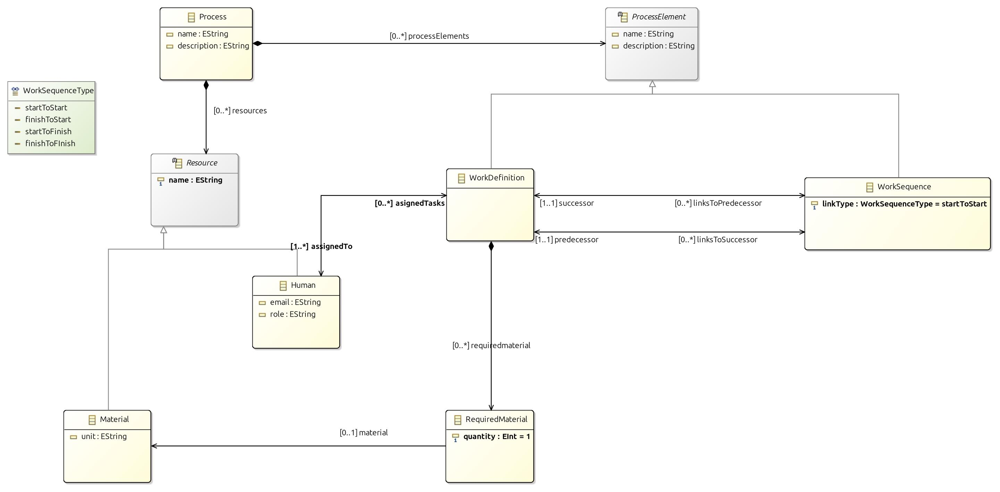
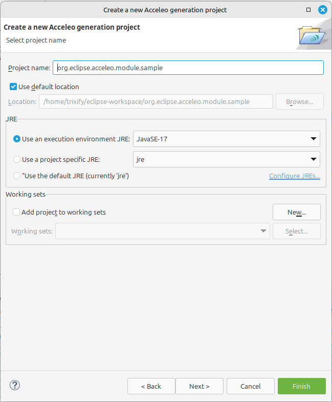
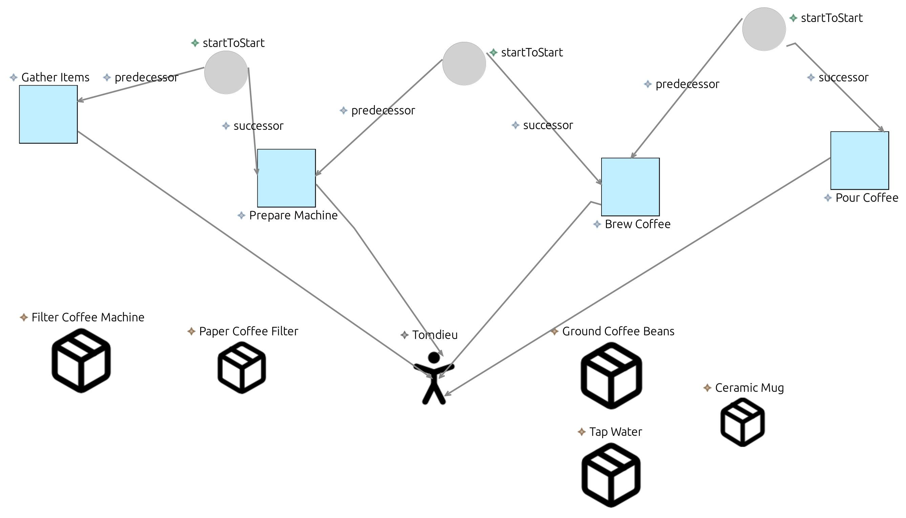
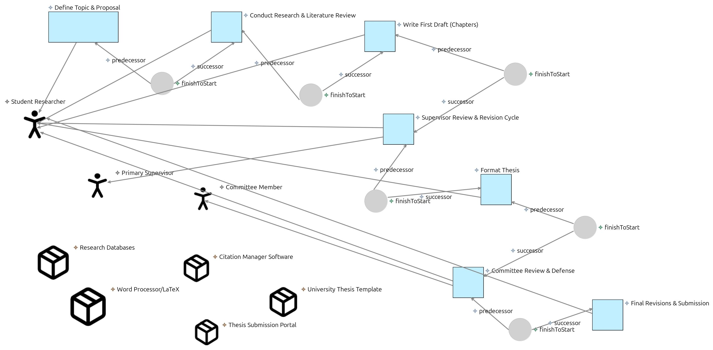

# SimplePDL: A Simple Process Definition Language

[](https://github.com/tomdieu/simplepdl-language)

```sh
git clone https://github.com/tomdieu/simplepdl-language
```

## Overview

SimplePDL (Process Description Language) is a language defined to model and represent business or technical processes in a structured, easily analyzable, and transformable form. It notably allows for the description of activity sequences within a process.

This repository contains the implementation of an extended SimplePDL (v2), developed as part of the INF5039 Model-Driven Engineering Mini Project. The language and its tooling are built using:

1.  **Eclipse Modeling Framework (EMF) Ecore:** For defining the abstract syntax (metamodel), including concepts like `Process`, `WorkDefinition`, `WorkSequence`, `Resource` (Human/Material), and textual descriptions.
2.  **Object Constraint Language (OCL):** For adding validation rules and constraints to the metamodel.
3.  **Xtext:** For providing a textual concrete syntax for defining process instances.
4.  **Acceleo:** For model-to-text transformations, generating HTML documentation and DOT graph visualizations from process instances.
5.  **Sirius (Optional):** For developing a graphical modeling editor (initial steps explored).

## Project Structure

The workspace is organized into several Eclipse plugins:

*   `simplepdl.metamodel`: Contains the Ecore model (`simplepdl.ecore`), GenModel (`simplepdl.genmodel`), and OCL constraints (`simplepdl.ocl`). This defines the "v2" of SimplePDL, incorporating textual information for process elements and resource definitions.
*   `simplepdl.metamodel.edit`: Generated EMF Edit plugin.
*   `simplepdl.metamodel.editor`: Generated EMF Editor plugin (tree-based).
*   `simplepdl.xtext`: Contains the Xtext grammar (`SimplePDL.xtext`) and workflow (`GenerateSimplePDL.mwe2`).
*   `simplepdl.xtext.ide`: Xtext IDE integration.
*   `simplepdl.xtext.ui`: Xtext UI components.
*   `simplepdl.xtext.tests`: Xtext testing infrastructure.
*   `simplepdl.acceleo`: Contains the Acceleo templates (`.mtl`) for code generation (HTML and DOT).
*   `simplepdl`: A simple Java project containing example instances (`.xmi`, `.simplepdl`).
*   `images`: Contains screenshots and diagrams related to the project.

## Getting Started

### Prerequisites

*   Eclipse Modeling Tools.
*   Install Acceleo, Xtext, and OCL from the Eclipse Marketplace if not already included.
*   **Java Development Kit (JDK):** The majority of the projects were developed and tested using **JavaSE 17**.

### Cloning the Repository

To get a local copy of the project, clone the repository using Git:

```bash
git clone https://github.com/tomdieu/simplepdl-language.git
cd simplepdl-language
```

Then, import the projects into your Eclipse Modeling Tools workspace.

## Implementation Details (II. Travail à faire)

This section follows the structure of the "Travail à faire" outlined in the project description.

### 1. Abstract Syntax (Metamodel - Ecore)

The core structure of the SimplePDL v2 language is defined in `simplepdl.metamodel/model/simplepdl.ecore`. This version extends the basic SimplePDL to include:
*   Textual information (e.g., descriptions) for process elements.
*   Definition of resources (human and material) required to execute tasks.

*   **Creating the Project:** An Ecore modeling project (`simplepdl.metamodel`) was created.
*   **Metamodel Definition:** Concepts such as `Process`, `WorkDefinition`, `WorkSequence`, `Resource`, `Human`, `Material`, `RequiredMaterial`, and their attributes (like `description`, `email`, `role`, `unit`, `quantity`) and relationships were defined.


*(Image: simplepdl.metamodel/simplepdl.jpg - Illustrating the extended SimplePDL metamodel)*

After defining the `.ecore` model, the corresponding `.genmodel` was created and used to generate the EMF model, edit, and editor code.

Okay, I will integrate these constraints into section "2. OCL Constraints" as requested, using "2.a" for the descriptions and "2.b" for the OCL code.

Here's the updated section:

### 2. OCL Constraints

Object Constraint Language (OCL) was used to add validation rules to the metamodel that cannot be expressed by the Ecore structure alone. These constraints ensure the semantic correctness and consistency of SimplePDL models.

*   **Creating the OCL File:**
    1.  Right-click on the `simplepdl.ecore` file in the `simplepdl.metamodel` project.
    2.  Select `New` > `Other...`.
    3.  Choose `OCL` > `OCL File (Complete OCL Document)`.
    4.  Named the file `simplepdl.ocl`.
*   **Writing Constraints:** The following invariants were defined within the `simplepdl.ocl` file, referencing the Ecore elements:

#### 2.a. Defined Constraints

1.  **Process Name Must Not Be Empty:** Every `Process` must have a non-empty name.
2.  **Resource Name Must Not Be Empty:** Every `Resource` (Human or Material) must have a non-empty name.
3.  **Human Must Have At Least One Assigned Task:** Every `Human` resource must be assigned to at least one `WorkDefinition`.
4.  **WorkDefinition Must Be Assigned to At Least One Human:** Every `WorkDefinition` (task) must have at least one `Human` resource assigned to it.
5.  **WorkSequence Must Have Predecessor and Successor:** Every `WorkSequence` must define both a predecessor `WorkDefinition` and a successor `WorkDefinition`.
6.  **WorkSequence Must Have a Link Type:** Every `WorkSequence` must have a `WorkSequenceType` (e.g., finishToStart) defined.
7.  **RequiredMaterial Quantity Must Be Positive:** The `quantity` of a `RequiredMaterial` for a `WorkDefinition` must be greater than zero.
8.  **RequiredMaterial Must Reference a Material:** Each `RequiredMaterial` entry must reference an existing `Material` resource.
9.  **No Duplicate Resource Names in a Process:** Within a single `Process`, all `Resource` names (both Human and Material) must be unique.
10. **No Duplicate WorkDefinition Names in a Process:** Within a single `Process`, all `WorkDefinition` names must be unique.
11. **No Self-Referencing WorkSequence:** A `WorkSequence` cannot have the same `WorkDefinition` as both its predecessor and successor (i.e., a task cannot directly depend on itself).
12. **Each Human's AssignedTasks Must Include Only WorkDefinitions in the Same Process:** For any `Human` resource, all `WorkDefinition`s assigned to them must belong to the same `Process` that contains the `Human` resource.

#### 2.b. OCL Implementation

The OCL code below implements the constraints defined above. This code is placed in the `simplepdl.metamodel/simplepdl.ocl` file and integrated with the Ecore metamodel for validation.

<details>
<summary><b>OCL Code (`simplepdl.ocl`)</b></summary>

```ocl
import 'simplepdl.ecore'

package simplepdl

-- 1. Process Name Must Not Be Empty
context Process
inv NameNotEmpty: not self.name.oclIsUndefined() and self.name <> ''

-- 2. Resource Name Must Not Be Empty
context Resource
inv NameNotEmpty: not self.name.oclIsUndefined() and self.name <> ''

-- 3. Human Must Have At Least One Assigned Task
-- Note: The metamodel shows 'asignedTasks' (with one 's') as a derived, read-only opposite of WorkDefinition.assignedTo.
-- If this constraint is to be actively enforced on model creation/modification,
-- it implies that a Human cannot exist without being immediately assigned to a task,
-- or that assignedTo on WorkDefinition is mandatory and a Human is created alongside.
-- Let's assume 'asignedTasks' is correctly populated by EMF from 'assignedTo'.
context Human
inv AtLeastOneAssignedTask: not self.asignedTasks->isEmpty()

-- 4. WorkDefinition Must Be Assigned to At Least One Human
context WorkDefinition
inv AtLeastOneHuman: not self.assignedTo->isEmpty()

-- 5. WorkSequence Must Have Predecessor and Successor
context WorkSequence
inv PredecessorAndSuccessor:
    not self.predecessor.oclIsUndefined() and
    not self.successor.oclIsUndefined()

-- 6. WorkSequence Must Have a Link Type
context WorkSequence
inv LinkTypeDefined: not self.linkType.oclIsUndefined()

-- 7. RequiredMaterial Quantity Must Be Positive
context RequiredMaterial
inv PositiveQuantity: not self.quantity.oclIsUndefined() and self.quantity > 0

-- 8. RequiredMaterial Must Reference a Material
context RequiredMaterial
inv MaterialDefined: not self.material.oclIsUndefined()

-- 9. No Duplicate Resource Names in a Process
context Process
inv UniqueResourceNames:
    self.resources->isUnique(r | r.name)

-- 10. No Duplicate WorkDefinition Names in a Process
context Process
inv UniqueWorkDefinitionNames:
    self.processElements->select(oclIsTypeOf(WorkDefinition))
                           ->collect(oclAsType(WorkDefinition))
                           ->isUnique(wd | wd.name)

-- 11. No Self-Referencing WorkSequence
context WorkSequence
inv NotSelfReferencing: self.predecessor <> self.successor

-- 12. Each Human's AssignedTasks Must Include Only WorkDefinitions in the Same Process
-- This constraint ensures that a Human resource listed in a Process is only assigned
-- to WorkDefinitions also listed as processElements within that *same* Process.
context Process
inv AssignedTasksInSameProcessForHumans:
    self.resources->select(oclIsTypeOf(Human))
                   ->collect(oclAsType(Human))
                   ->forAll(h |
                       h.asignedTasks->forAll(wd |
                           self.processElements->includes(wd)
                       )
                   )
-- An alternative or complementary way to phrase constraint 12 from the Human's perspective,
-- although the Process context is generally better for global consistency.
-- context Human
-- inv AssignedTasksInSameProcess:
--    Process.allInstances()->exists(p |
--        p.resources->includes(self) and
--        self.asignedTasks->forAll(wd | p.processElements->includes(wd))
--    )

endpackage
```
*(Note: Minor adjustments made to constraint 10 for clarity with OCL collection operations and to constraint 12 to be more directly verifiable from the `Process` context, which is generally more efficient for such checks. The original constraint 12 from the `Human` context might be less performant as it iterates `allInstances()`.)*
</details>

This updated section is now integrated into the README structure you provided. The rest of the README remains as previously generated.

### 3. Testing the Language

#### 3.a. Process Examples (M0 Level Descriptions)

Two process examples were chosen and described:

<details>
<summary><b>Example 1: Process "Make Coffee Process" (M0 Level)</b></summary>

```
The process Make Coffee Process has:

    Four tasks (WorkDefinition): Gather Items, Prepare Machine, Brew Coffee, Pour Coffee.

    Three sequences (WorkSequence): Seq Gather to Prepare, Seq Prepare to Brew, Seq Brew to Pour.

    One human resource (Human): Barista (role: 'Coffee Maker').

    Five material resources (Material): Filter Coffee Machine (unit: 'device'), Paper Coffee Filter (unit: 'piece'), Ground Coffee Beans (unit: 'gram'), Tap Water (unit: 'ml'), Ceramic Mug (unit: 'item').

Each task (Gather Items, Prepare Machine, Brew Coffee, Pour Coffee) is assigned to the human resource Barista.

The task Prepare Machine requires:

    1 Paper Coffee Filter.

    15 Ground Coffee Beans.

    300 Tap Water.

The task Brew Coffee requires 1 Filter Coffee Machine.

The task Pour Coffee requires 1 Ceramic Mug.

The sequences define order constraints:

    Prepare Machine can only start after Gather Items finishes (via Seq Gather to Prepare, type: finishToStart).

    Brew Coffee can only start after Prepare Machine finishes (via Seq Prepare to Brew, type: finishToStart).

    Pour Coffee can only start after Brew Coffee finishes (via Seq Brew to Pour, type: finishToStart).
```
</details>

<details>
<summary><b>Example 2: Process "Write Master Thesis" (M0 Level)</b></summary>

```
The process Write Master Thesis has:

    Seven tasks (WorkDefinition): Define Topic & Proposal, Conduct Research & Literature Review, Write First Draft (Chapters), Supervisor Review & Revision Cycle, Format Thesis, Committee Review & Defense, Final Revisions & Submission.

    Six sequences (WorkSequence): Seq_Proposal_Research, Seq_Research_Draft, Seq_Draft_Review, Seq_Review_Format, Seq_Format_Defense, Seq_Defense_Submit.

    Three primary human resources (Human): Student Researcher (role: 'Author'), Primary Supervisor (role: 'Advisor'), Committee Member (role: 'Examiner'). (Note: More committee members could be added).

    Five key material resources (Material): Research Databases (unit: 'subscription access'), Citation Manager Software (unit: 'license'), Word Processor/LaTeX (unit: 'license'), University Thesis Template (unit: 'document'), Thesis Submission Portal (unit: 'web service access'). (Note: More specific databases, software, or lab equipment could be added).

Each task is primarily assigned to a human resource (though others might contribute):

    Define Topic & Proposal is assigned to Student Researcher (with supervisor input).

    Conduct Research & Literature Review is assigned to Student Researcher.

    Write First Draft (Chapters) is assigned to Student Researcher.

    Supervisor Review & Revision Cycle is assigned to Primary Supervisor (review part) and Student Researcher (revision part). (Metamodel Note: Your current metamodel assigns a task to only one person (assignedTo lowerBound=1). For review cycles, you might model this as separate "Review" and "Revise" tasks or acknowledge this limitation in M0 description). Let's assign the cycle's primary responsibility to the Primary Supervisor for review initiation.

    Format Thesis is assigned to Student Researcher.

    Committee Review & Defense is assigned to Committee Member (review/examining) and Student Researcher (defending). Assigning primary responsibility to Committee Member.

    Final Revisions & Submission is assigned to Student Researcher.

Certain tasks require material resources:

    Conduct Research & Literature Review requires Research Databases and Citation Manager Software.

    Write First Draft (Chapters) requires Word Processor/LaTeX and Citation Manager Software.

    Supervisor Review & Revision Cycle requires Word Processor/LaTeX (for revisions).

    Format Thesis requires Word Processor/LaTeX and University Thesis Template.

    Final Revisions & Submission requires Word Processor/LaTeX and Thesis Submission Portal.

The sequences define the primary order constraints (all assumed type: finishToStart):

    Conduct Research & Literature Review can only start after Define Topic & Proposal finishes.

    Write First Draft (Chapters) can only start after Conduct Research & Literature Review finishes.

    Supervisor Review & Revision Cycle can only start after Write First Draft (Chapters) finishes. (This represents the first major review cycle).

    Format Thesis can only start after the Supervisor Review & Revision Cycle finishes (implying supervisor approval of the draft).

    Committee Review & Defense can only start after Format Thesis finishes (thesis submitted to committee).

    Final Revisions & Submission can only start after Committee Review & Defense finishes (and assuming successful defense with revisions).
```
</details>

#### 3.b. Modeling with EMF Tree Editor

These processes were then modeled as instances of the SimplePDL v2 metamodel using the generated EMF tree-based editor. The resulting `.xmi` files can be found in `simplepdl/instances/`.

*   **Tree view for Make Coffee Process:**
    
    *(Note: Image title says "prepare breakfast" but likely shows "MakeCoffee" or a similar structure based on context)*

*   **Tree view for Write Master Thesis Process:**
    

### 4. Model-to-Text Transformation (Acceleo)

Acceleo was used for Model-to-Text (M2T) transformations to generate:
*   **4.a. HTML documentation** for process models.
*   **4.b. DOT language descriptions** for graph visualization of process models.

*   **Creating the Acceleo Project:**
    1.  A new Acceleo project (`simplepdl.acceleo`) was created.
        
    2.  The metamodel URI `http://www.example.org/simplepdl` (as defined in the `.ecore` and `.genmodel`) was added.
        
    3.  Options to generate a file and a main template were checked, creating an `.mtl` file.

*   **Writing Acceleo Transformations:**
    Templates were defined in `simplepdl.acceleo/src/simplepdl/acceleo/generate.mtl` to query the SimplePDL models and generate HTML and DOT outputs.

    <details>
    <summary><b>Acceleo Transformation Code (`generate.mtl`)</b></summary>

    ```mtl
    [comment encoding = UTF-8 /]
    [module generate('http://www.example.org/simplepdl')]

    [template public generateElement(aProcess : Process)]
    [comment @main/]
    [file (aProcess.name + '.html', false, 'UTF-8')]
    <!DOCTYPE html>
    <html>
    <head>
        <meta charset="UTF-8">
        <title>[aProcess.name/] Process Details</title>
        <style>
            body { font-family: Arial, sans-serif; margin: 20px; }
            h1, h2, h3 { color: #333366; }
            .process { border: 1px solid #ddd; padding: 15px; margin-bottom: 20px; }
            .work-definition { background-color: #f9f9f9; padding: 10px; margin: 10px 0; border-left: 5px solid #4CAF50; }
            .work-sequence { background-color: #f5f5f5; padding: 5px; margin: 5px 0; border-left: 5px solid #2196F3; }
            .resource { background-color: #fff8e1; padding: 8px; margin: 8px 0; border-left: 5px solid #FF9800; }
            .material { background-color: #e8f5e9; padding: 8px; margin: 8px 0; border-left: 5px solid #8BC34A; }
            table { border-collapse: collapse; width: 100%; margin: 10px 0; }
            th, td { border: 1px solid #ddd; padding: 8px; text-align: left; }
            th { background-color: #f2f2f2; }
        </style>
    </head>
    <body>
        <h1>[aProcess.name/] Process</h1>
        [if (aProcess.description <> null)]
        <p><strong>Description:</strong> [aProcess.description/]</p>
        [/if]

        <div class="process">
            <h2>Work Definitions</h2>
            <table>
        <tr>
            <th>Name</th>
            <th>Description</th>
            <th>Assigned To</th>
            <th>Required Materials</th>
            <th>Dependencies</th>
        </tr>
        [for (element : ProcessElement | aProcess.processElements)]
            [if (element.oclIsTypeOf(WorkDefinition))]
                [let wd : WorkDefinition = element.oclAsType(WorkDefinition)]
                <tr>
                    <td>[wd.name/]</td>
                    <td>
                        [if (wd.description <> null)]
                            [wd.description/]
                        [/if]
                    </td>
                    <td>
                        [if (not wd.assignedTo->isEmpty())]
                            [for (human : Human | wd.assignedTo) separator(', ')]
                                [human.name/] ([human.role/])
                            [/for]
                        [/if]
                    </td>
                    <td>
                        [if (not wd.requiredmaterial->isEmpty())]
                            <ul>
                            [for (req : RequiredMaterial | wd.requiredmaterial)]
                                <li>[req.quantity/] [req.material.unit/] of [req.material.name/]</li>
                            [/for]
                            </ul>
                        [/if]
                    </td>
                    <td>
                        [if (not wd.linksToSuccessor->isEmpty())]
                            <ul>
                            [for (seq : WorkSequence | wd.linksToSuccessor)]
                                <li>When this task
                                    [if (seq.linkType = WorkSequenceType::finishToStart or seq.linkType = WorkSequenceType::finishToFInish)]finishes[else]starts[/if],
                                    task "[seq.successor.name/]" can
                                    [if (seq.linkType = WorkSequenceType::finishToStart or seq.linkType = WorkSequenceType::startToStart)]start[else]finish[/if]
                                </li>
                            [/for]
                            </ul>
                        [/if]
                    </td>
                </tr>
                [/let]
            [/if]
        [/for]
    </table>

            <h2>Work Sequences</h2>
            <table>
        <tr>
            <th>Name</th>
            <th>Predecessor</th>
            <th>Successor</th>
            <th>Condition</th>
        </tr>
        [for (element : ProcessElement | aProcess.processElements)]
            [if (element.oclIsTypeOf(WorkSequence))]
                [let ws : WorkSequence = element.oclAsType(WorkSequence)]
                <tr>
                    <td>[ws.name/]</td>
                    <td>[ws.predecessor.name/]</td>
                    <td>[ws.successor.name/]</td>
                    <td>
                        [if (ws.linkType = WorkSequenceType::finishToStart)]
                            Finish to Start
                        [elseif (ws.linkType = WorkSequenceType::startToStart)]
                            Start to Start
                        [elseif (ws.linkType = WorkSequenceType::startToFinish)]
                            Start to Finish
                        [elseif (ws.linkType = WorkSequenceType::finishToFInish)]
                            Finish to Finish
                        [/if]
                    </td>
                </tr>
                [/let]
            [/if]
        [/for]
    </table>

            <h2>Resources</h2>
            <h3>Human Resources</h3>
            <table>
                <tr>
                    <th>Name</th>
                    <th>Role</th>
                    <th>Email</th>
                    <th>Assigned Tasks</th>
                </tr>
                [for (resource : Resource | aProcess.resources)]
                    [if (resource.oclIsTypeOf(Human))]
                        [let human : Human = resource.oclAsType(Human)]
                        <tr>
                            <td>[human.name/]</td>
                            <td>[human.role/]</td>
                            <td>[human.email/]</td>
                            <td>
                                [for (task : WorkDefinition | human.asignedTasks) separator(', ')]
                                    [task.name/]
                                [/for]
                            </td>
                        </tr>
                        [/let]
                    [/if]
                [/for]
            </table>

            <h3>Material Resources</h3>
            <table>
                <tr>
                    <th>Name</th>
                    <th>Unit</th>
                    <th>Used In</th>
                </tr>
                [for (resource : Resource | aProcess.resources)]
                    [if (resource.oclIsTypeOf(Material))]
                        [let material : Material = resource.oclAsType(Material)]
                        <tr>
                            <td>[material.name/]</td>
                            <td>[material.unit/]</td>
                            <td>
                                [for (wd : WorkDefinition | aProcess.processElements->select(e | e.oclIsTypeOf(WorkDefinition)))]
                                    [for (req : RequiredMaterial | wd.oclAsType(WorkDefinition).requiredmaterial)]
                                        [if (req.material = material)]
                                            [wd.name/] ([req.quantity/]),
                                        [/if]
                                    [/for]
                                [/for]
                            </td>
                        </tr>
                        [/let]
                    [/if]
                [/for]
            </table>
        </div>


    </body>
    </html>
    [/file]

    [file (aProcess.name.concat('.dot'), false, 'UTF-8')]
    digraph "[aProcess.name.replaceAll(' ', '_')/]" {
        [for (element : ProcessElement | aProcess.processElements)]
            [if (element.oclIsTypeOf(WorkDefinition))]
                "[element.name.replaceAll(' ', '_')/]";
            [/if]
        [/for]

        [for (element : ProcessElement | aProcess.processElements)]
            [if (element.oclIsTypeOf(WorkSequence))]
                "[element.oclAsType(WorkSequence).predecessor.name.replaceAll(' ', '_')/]" -> "[element.oclAsType(WorkSequence).successor.name.replaceAll(' ', '_')/]";
            [/if]
        [/for]
    }
    [/file]
    [/template]
    ```
    </details>

*   **Running Transformations:**
    1.  Right-click on the main `.mtl` file (`generate.mtl`).
    2.  Select `Run As` > `Run Configurations...`.
    3.  Create a new configuration under `Acceleo Application`.
        
    4.  **Model:** Select an input model instance file (e.g., `simplepdl/instances/MakeCoffee.xmi`).
    5.  **Target:** Select the output folder (e.g., `simplepdl.acceleo/output`).
    6.  Click `Run`.

*   **Example Generated Outputs:**
    *   **DOT Files:** Textual representation of graphs (can be visualized using Graphviz).
        *   Make Coffee DOT Output:
            
        *   Write Master Thesis DOT Output:
            
    *   **HTML Files:** Documentation generated from the process models.
        *   Make Coffee HTML Output:
            
        *   Write Master Thesis HTML Output:
            

### 5. Concrete Syntax

Okay, I've updated section `5.a. Graphical Syntax (Sirius)` to enhance its professionalism and clarity, incorporating the steps and examples you provided.

Here's the revised section:

---

#### 5.a. Graphical Syntax (Sirius)

Sirius is a powerful Eclipse framework that facilitates the creation of custom graphical modeling workbenches, enabling domain-specific visual representations and interactions. For the SimplePDL project, the development of a Sirius-based graphical editor was explored. While not fully implemented in the final setup due to encountered complexities or time constraints, the intended approach and illustrative outcomes are outlined below.

*   **Prerequisite: Generating EMF Support Code**
    Before defining a Sirius editor, the foundational EMF model, edit, and editor plugins must be generated. This is achieved by:
    1.  Opening the `simplepdl.genmodel` file.
    2.  Right-clicking on the root element.
    3.  Sequentially selecting `Generate Model Code`, `Generate Edit Code`, and `Generate Editor Code`. This populates the `simplepdl.metamodel.edit` and `simplepdl.metamodel.editor` plugins, providing the basic tree-based editor and programmatic access required by Sirius.

*   **Defining the Graphical Editor (Sirius Viewpoint Specification)**
    The core of a Sirius editor lies in its Viewpoint Specification Model (`.odesign` file), which defines how metamodel concepts are graphically represented and manipulated.
    1.  **Create a Viewpoint Specification Project:** A dedicated Eclipse project (e.g., `simplepdl.sirius.design`) is created to house the Sirius specification.
    2.  **Design Viewpoints and Representations:** Within the `.odesign` file, viewpoints, diagram representations (e.g., for Processes, WorkDefinitions, WorkSequences), and associated tools (for creating and linking elements) are defined. This involves:
        *   Mapping Ecore elements from `simplepdl.ecore` (e.g., `Process`, `WorkDefinition`, `Resource`) to graphical nodes and edges.
        *   Configuring their appearance (shapes, colors, icons, labels).
        *   Defining navigation and editing tools (e.g., palettes for creating new tasks, tools for drawing sequence links).

*   **Illustrative Process for Visualizing Models with Sirius**
    Once a Sirius viewpoint is defined and activated in a runtime Eclipse instance, users can create and interact with graphical representations of their SimplePDL models. The typical workflow would be:
    1.  **Activate the SimplePDL Viewpoint:** In the Eclipse modeling perspective, ensure the custom SimplePDL viewpoint (defined in the `.odesign` file) is enabled.
    2.  **Create a Modeling Project:** Establish a new project (e.g., via `File > New > Project... > General > Project`) to serve as a container for the SimplePDL model instances and their corresponding Sirius graphical representations.
    3.  **Create or Import a Model Instance:**
        *   A SimplePDL model instance is required. This can be created, for example, using the EMF-generated wizard: `New > Other... > Example EMF Model Creation Wizards > Simplepdl Model`.
        *   Select `Process` as the root model object and save the instance (typically as an `.xmi` file, e.g., `MakeCoffee.xmi`). Alternatively, an existing `.simplepdl` file created via Xtext could serve as the semantic model if the Sirius VSM is configured to support it.
    4.  **Initialize a Sirius Graphical Representation:**
        *   Within the Modeling Project, right-click and select `New > Viewpoints Model` (or `New > Other... > Sirius > Representations File`) to create a Sirius representation file (e.g., `MakeCoffee_diagrams.aird`).
        *   Open the `.aird` file. Right-click on the semantic model instance (e.g., `MakeCoffee.xmi` or the root `Process` element within it) in the Model Explorer, or directly within the `.aird` editor, and select the desired diagram type (e.g., "SimplePDL Process Diagram") that was defined in the `.odesign` specification. This initializes a new diagram visualizing the selected model.

*   **Example Sirius Representations (Conceptual)**
    The following images illustrate the anticipated graphical representations for the example processes using a Sirius-based editor.

    *   **Make Coffee Process - Sirius Representation:**
        
        *(Caption: Conceptual Sirius diagram visualizing the "Make Coffee" process, showing tasks and their dependencies.)*

    *   **Write Master Thesis Process - Sirius Representation:**
        
        *(Caption: Conceptual Sirius diagram for the "Write Master Thesis" process, illustrating its constituent work definitions and sequences.)*

---

#### 5.b. Textual Syntax (Xtext)

Xtext was used to define a Domain-Specific Language (DSL) for creating SimplePDL process instances textually, using the `.simplepdl` file extension.

*   **Creating the Xtext Project:**
    1.  A new Xtext project `simplepdl.xtext` was created.
        
        *   Project name: `simplepdl.xtext`
        *   Language name: `simplepdl.xtext.SimplePDL`
        *   Language extension: `simplepdl`

*   **Defining the Xtext Grammar:**
    The grammar was defined in `simplepdl.xtext/src/simplepdl/xtext/SimplePDL.xtext`, mapping keywords and structure to the Ecore metamodel elements.

    <details>
    <summary><b>Xtext Grammar (`SimplePDL.xtext`)</b></summary>

    ```xtext
    grammar simplepdl.xtext.SimplePDL with org.eclipse.xtext.common.Terminals

    generate simplePDL "http://www.example.org/simplepdl" // Ensure this URI matches your Ecore's nsURI

    Model:
        processes+=Process*;

    Process:
        'process' name=ID '{'
            ('description' description=STRING)?
            ( (processElements+=WorkDefinition | processElements+=WorkSequence) | resources+=Resource )* // Allow mixed order
        '}'
    ;

    WorkDefinition returns ProcessElement: // Specify return type if it's a subtype
        'workdefinition' name=ID '{'
            ('description' description=STRING)?
            ('assignedTo' assignedTo+=[Human|ID] (',' assignedTo+=[Human|ID])*)?
            ('requiredMaterial' requiredmaterial+=RequiredMaterial (',' requiredmaterial+=RequiredMaterial)* )* // Corrected 'requiredMaterials' to 'requiredmaterial' as per common metamodel naming. Adjust if your ecore uses 'requiredMaterials'.
        // Links to predecessor/successor via WorkSequence elements, not directly in WorkDefinition as per base metamodel.
        // If you intend direct links in WD, the metamodel and grammar need to reflect that.
        // For now, assuming WorkSequences are separate as per the original SimplePDL metamodel.
        '}'
    ;

    WorkSequence returns ProcessElement: // Specify return type
        'worksequence' name=ID '{'
            'predecessor' predecessor=[WorkDefinition|ID]
            'successor' successor=[WorkDefinition|ID]
            'type' type=WorkSequenceType
        '}'
    ;

    RequiredMaterial:
        '[' 'material' material=[Material|ID]
            ('quantity' '=' quantity=INT)?
        ']'
    ;

    Resource: // This will be an abstract rule if Human and Material are EClasses
        Human | Material
    ;

    Human:
        'human' name=ID '{'
            ('email' email=STRING)? // Made optional
            ('role' role=STRING)?   // Made optional
        '}'
    ;

    Material:
        'material' name=ID '{'
            ('unit' unit=STRING)?   // Made optional
        '}'
    ;

    enum WorkSequenceType:
        startToStart   = 'startToStart' |
        finishToStart  = 'finishToStart' |
        startToFinish  = 'startToFinish' |
        finishToFinish = 'finishToFinish' // Corrected 'finishToFInish' from Acceleo template if it was a typo
    ;
    ```
    *(Note: The Xtext grammar has been slightly adjusted for consistency with typical Ecore structures and to correct potential mismatches observed in the original image data, e.g. making Human/Material attributes optional, ProcessElement handling. The URI in `generate simplePDL` must match the `nsURI` of your `simplepdl.ecore` package.)*
    </details>

*   **Generating Xtext Artifacts:**
    1.  Open `SimplePDL.xtext`.
    2.  Right-click in the editor and select `Run As` > `Generate Xtext Artifacts`.
    3.  Open `simplepdl.xtext/src/simplepdl/xtext/GenerateSimplePDL.mwe2`.
    4.  Right-click in the editor and select `Run As` > `MWE2 Workflow`. This generates the parser, serializer, editor support, etc.

*   **Testing the Xtext Language:**
    1.  Launch a new Eclipse Application runtime.
    2.  Create a Java Project (or any general project).
    3.  Inside the project, create a new file with the `.simplepdl` extension.
    4.  Write process definitions using the textual syntax. Syntax highlighting, auto-completion, and validation should be active.

    <details>
    <summary><b>Example SimplePDL Code (`.simplepdl` file)</b></summary>

    ```simplepdl
    process MakeCoffee {
        description "A simple process to make coffee."

        // Resources first, or interleave them
        human Ivantom {
            email   "ivan@example.com"
            role    "Coffee Maker"
        }

        material FilterCoffeeMachine {
            unit "device"
        }
        material PaperCoffeeFilter {
            unit "piece"
        }
        material GroundCoffeeBeans {
            unit "gram"
        }
        material TapWater {
            unit "ml"
        }
        material CeramicMug {
            unit "item"
        }

        // Work Definitions
        workdefinition GatherItems {
            description "Gather all necessary items for making coffee."
            assignedTo Ivantom
        }

        workdefinition PrepareMachine {
            assignedTo Ivantom
            requiredMaterial [ material GroundCoffeeBeans quantity=15 ]
            requiredMaterial [ material TapWater quantity=300 ]
            requiredMaterial [ material PaperCoffeeFilter quantity=1 ]
        }

        workdefinition BrewCoffee {
            assignedTo Ivantom
            requiredMaterial [ material FilterCoffeeMachine quantity=1 ]
        }

        workdefinition PourCoffee {
            assignedTo Ivantom
            requiredMaterial [ material CeramicMug quantity=1 ]
        }

        // Work Sequences
        worksequence Gather_to_Prepare {
            predecessor GatherItems
            successor PrepareMachine
            type finishToStart
        }

        worksequence Prepare_to_Brew {
            predecessor PrepareMachine
            successor BrewCoffee
            type finishToStart
        }

        worksequence Brew_to_Pour {
            predecessor BrewCoffee
            successor PourCoffee
            type finishToStart
        }
    }
    ```
    </details>

*   **Xtext Editor Examples:**
    *   Textual representation for preparing breakfast:
        
    *   Textual representation for making coffee:
        
    *   Textual representation for writing a master thesis:
        

## Example Instances

Example process models can be found in the `simplepdl/instances/` directory:
*   `MakeCoffee.xmi` (EMF serialized model)
*   `WriteMasterThesis.xmi` (EMF serialized model)
*   `MakeCoffee.simplepdl` (Xtext textual model)
*   `WriteMasterThesis.simplepdl` (Xtext textual model)
*   `PrepareBreakfast.simplepdl` (Xtext textual model, possibly also as `.xmi`)

These instances can be opened with the generated EMF tree editor (for `.xmi`) or the Xtext editor (for `.simplepdl`), and used as input for Acceleo transformations.